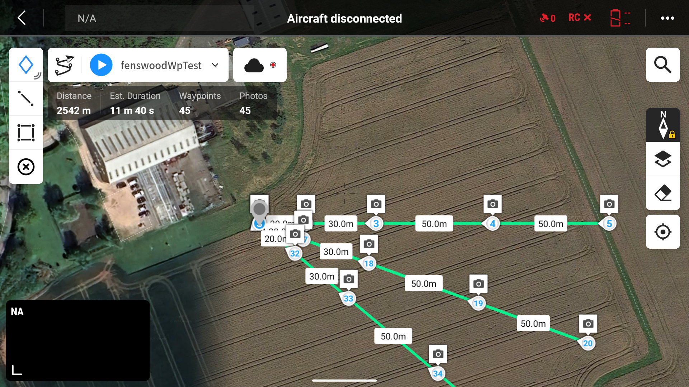

# DJIWaypointGenerator

## Summary 
Generates parametrically defined waypoint missions for DJI.
The mission is a set of waypoints placed on the cylindrical grid described by setHeading, setAltRel and setDist.
At each waypoint, a picture is taken, looking at the POI.

## DJI documentation
See DJI documentation [here](https://developer.dji.com/doc/cloud-api-tutorial/en/api-reference/dji-wpml/common-element.html).

## Sample mission screenshot

